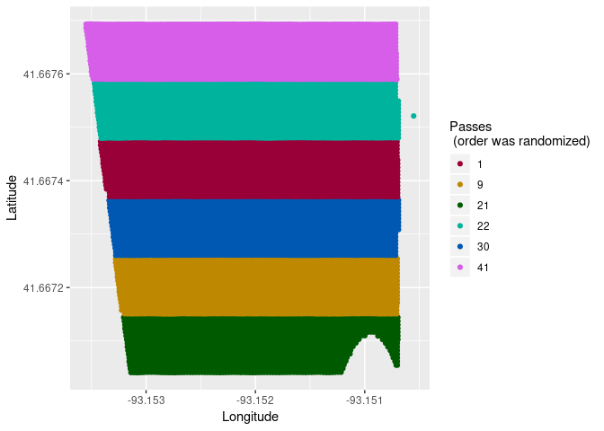
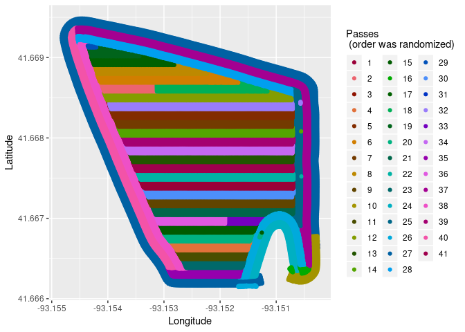

Ag Machine Pass Numbering
================
Eric Coronel
August 6, 2018

# Purpose of this script

Data collected by agricultural equipment is not user friendly,
especially when within-field data manipulation is needed. It is simple
to calculate average yield or fuel usage per field. The challenge is
obtaining attributes from individual field passes inside the field when
there are no identifiers to perform subsettings or groupings.  
The code included here uses time difference in seconds between
observations to separate machinery passes. The threshold for separating
passes can be modified.

## Packages needed

``` r
library(dplyr)
library(ggplot2)
library(rgdal)
```

## Importing the seeding shapefile

A publicly available seeding shapefile can be found at a [Deere
website](https://developer.deere.com/#!documentation&doc=.%2Fmyjohndeere%2FfieldOperations.htm&anchor=).
The sample Seeding shapefile can be downloaded from the following
[link](https://developer.deere.com/content/documentation/merriweather_seeding.zip).
The zip file needs to be decompressed into a temp file before importing.

``` r
# Download zipfile into tempfile
url <- "https://developer.deere.com/content/documentation/merriweather_seeding.zip"
tmpfn <- tempfile()
zipfile <- download.file(url, tmpfn)
files <- unzip(tmpfn, exdir = tempdir())
```

Once decompressed it can be imported using `rgdal::readORG` with
`pointDropZ = TRUE` argument because the shapefile has an empty Z
column; likely an error during the creation of the file. I created a
working copy to avoid manipulating the original file since it takes
about 30 seconds to import the original shapefile.

``` r
# Importing the shapefile
seeding_shapefile <- readOGR(dsn = files[4], pointDropZ = T)
```

    ## OGR data source with driver: ESRI Shapefile 
    ## Source: "/tmp/RtmprEJgXU/doc/Merriweather Farms-JT-01-Corn.shp", layer: "Merriweather Farms-JT-01-Corn"
    ## with 63761 features
    ## It has 10 fields

``` r
# Working copy
work_copy <- seeding_shapefile
```

## First processing

This chunk does the following:

  - Creates a datetime variable.
  - Calculates time difference in seconds among consecutive records.
  - Creates an indicator variable that assigns 0 if time difference is
    between 0 to 6 seconds, and 1 to all others.
  - Calculates the cumulative sum of the indicator variable.

Since data are arranged in ascending time order, the cumulative sum of
the indicator variable gives us the total number of passes.

``` r
work_copy@data <- work_copy@data %>%
  mutate(datetime = as.POSIXct(Time, format = "%m/%d/%Y %H:%M:%S"),
         diff1 = c(NA, diff(datetime)),
         indicator = ifelse(diff1 %in% c(0:6), 0, 1),
         pass_num = cumsum(indicator))
```

## Calculating observations per pass

Another useful attribute for grouping or subsetting is knowing the
number of observations per pass. This can be added with
`dplyr::add_tally` which perform

``` r
work_copy@data <- work_copy@data %>%
  group_by(pass_num) %>%
  add_tally(pass_num) %>% 
  ungroup()
```

## Cleaning up temp columns

This chunk:

  - Removes `datetime`, `diff1`, and `indicator` variables.
  - Makes actual pass numbers variable, `pass_num`, a factor for
    plotting.

<!-- end list -->

``` r
work_copy@data <- work_copy@data %>%
  select(-datetime, -diff1, -indicator) %>%
  mutate(pass_factor = factor(pass_num))
```

## Giving the coordinates for each point

It is often useful to have the coordinates as part of the attribute
table.

``` r
# Creating file with coordinates
xycoords <- work_copy %>%
  coordinates() %>%
  data.frame

# Joining the coordinates with the shapefile
work_copy@data <- work_copy@data %>%
  bind_cols(xycoords)
```

## Ploting final version

``` r
# Using a subset for faster display
filter(work_copy@data, pass_num %in% 20:25) %>% 
  ggplot(., aes(x = coords.x1, y = coords.x2, color = pass_factor)) +
  geom_point() +
  scale_color_manual(values = sample(colors(nlevels(work_copy$pass_factor)))) +
  labs(x = "Longitude",
       y = "Latitude",
       color = "Passes \n (order was randomized)")
```

<!-- -->

``` r
# Plotting the entire shapefile
ggplot(work_copy@data, aes(x = coords.x1, y = coords.x2, color = pass_factor)) +
  geom_point() +
  scale_color_manual(values = sample(colors(nlevels(work_copy$pass_factor)))) +
  labs(x = "Longitude",
       y = "Latitude",
       color = "Passes \n (order was randomized)")
```

<!-- -->
